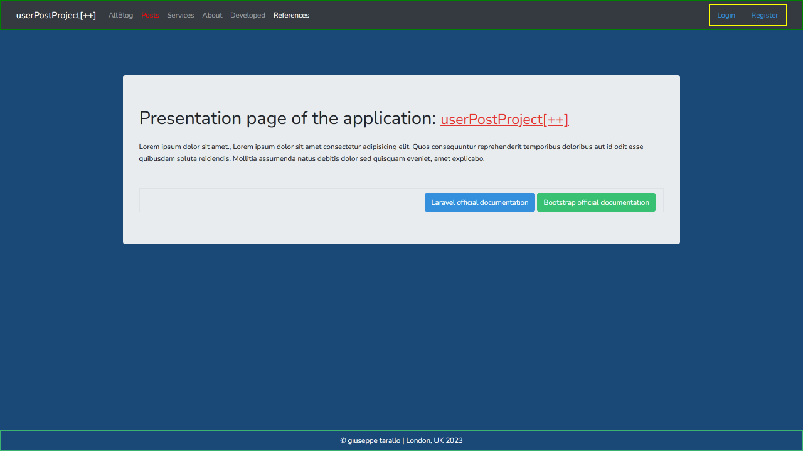
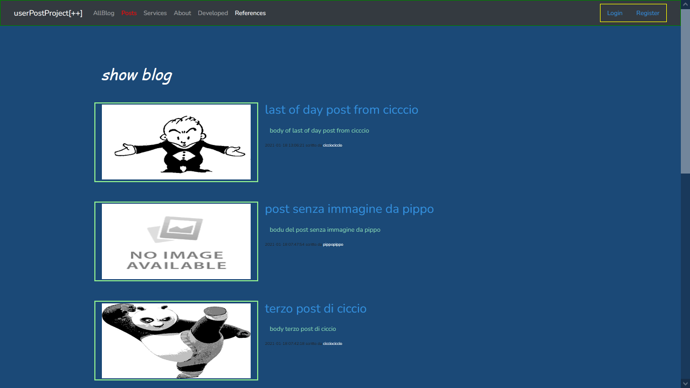
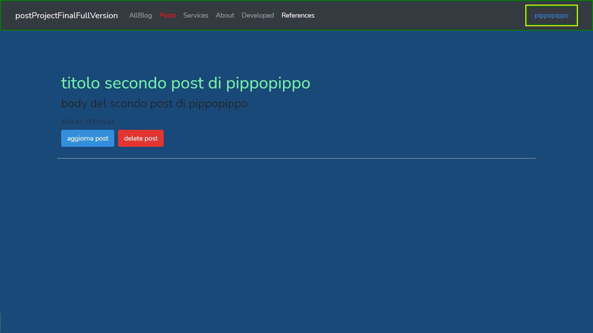
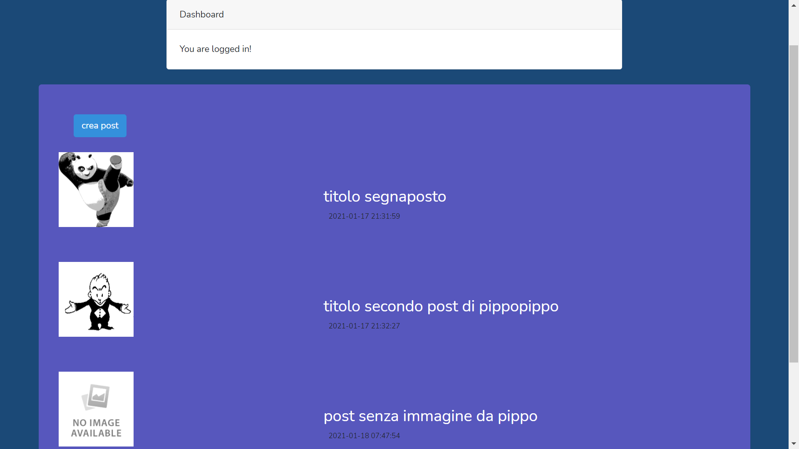
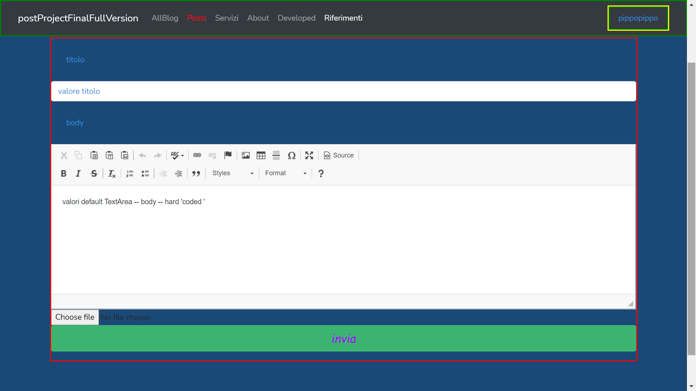

# Project description 

User post project
------------------------

**Purpose of the application:** 

The application gives the possibility to a logged in user to create, edit or delete their own posts.

______________________________________________________________________________________________________
<br/>

***Description:*** 

The project is focused on connections to the database, in particular with relationships between tables of type One (user) to Many (Posts), the application presents itself with a home page where through a navigation bar it allows to select the service route, the user not logged in can navigate in all parts of the site except the route: "Posts", as to access this area the user must be authenticated, if the user is not authorized and tries to access this section, he is invited to log on.

If the user is authenticated, the "Posts" section is accessible and gives the possibility to insert, edit, delete the contents for his account.

When a user is logged in, their name is shown in the navigation bar and if clicked, they are redirected to their DASHBOARD, where they can check their posts or log out from there.

All routes with the exception of "Posts" are freely accessible by all visitors.

<!--
*The dummy type records, relating to Authors and Books contained in a MySQL db are created through Seeder and Factory.
When an Author is removed, all the books connected to him are also removed in cascade thanks to the constraints.*
-->


**Other features of the project:**

* Application based on One to Many relationships
* Use of Auth middleware to control user permissions
* Shows you how to customize and control Auth middleware views and elements
* Uses Bootstrap for styling CSS classes
* Show how to use static asset assets like .css and .js files
* Shows how to implement One-to-Many relationships in Model files
* Show how to use Form :: OOP, from package: laravelcollective / html
* Show how to send PUT and DELETE requests via method spoofing
* Show how to upload image files with FORM :: file
* shows how to use the symlink to the storage folder
* Shows how to call application controller for Laravel versions> 7 via Fully-Qualified Class Names
* How to implement a text formatting editor in javascritp via libreira CDN, ckeditor
* How to get data from db and format them in html using the appropriate Blade syntax


*What you need to create to make the application work:*
<br><br>
Create a db called: "**project_post_user_final_version**"<br>
create two tables and populate: "**users**" and "**posts**"<br>
You can use the db dump file: "**DB-posts-utente.sql**" <br>

<br><br>

**Commands that could be used to run the application:**

*Laravel dependencies:*

```
$composer dump-autoload
$composer install
```

*Laravel auth and ui scaffolding (for laravel 8)*

```
$composer require laravel / ui
$php artisan ui vue --auth
```

*NPM dependencies / compile resource*

```
$npm install
$npm run dev
```

*Sets the APP_KEY value in your .env:*
```
$php artisan key: generate
```

*Install laravelcollective for FORM :: OOP*

```
$composer require laravelcollective/html
```

*Creation of symlink*

```
 $php artisan storage:link
```

<br/>
<br/>

**PS:** *If the symlink folder 'storage' in not accessible from a file manager like explorer, delete it and recreate it with the previous command*


<br />
<br />
<br />
<br />

The following images represent the main parts of the application

<br>


*Home page*




*All blogs page*



*Delete update user post*



*User dashboard*



*Create blog*



*Login form*


<hr>
<br>
<br>
<br>
<br>


# Descrizione Progetto

Progetto User post 
------------------------

**Scopo dell'applicazione:** 
L'applicazione da' la possibilita' ad un utente loggato, di creare editare o eliminare i propi post.

***Descrizione:***

Il progetto e' incentrato sulle connessioni al db in particolare con relazioni fra tabelle di tipo Uno (utente) a Molti (Posts), l'applicazione si presenta con una pagina iniziale dove tramite una barra di navigazione premette di selezionare la rotta di servizio, l'utente non loggato puo' navigare in tutte le parti del sito ad eccetto della rotta: "Posts", in quanto per accedere a quest'area l'utente deve essere  autenticato, se l'utente non e' autorizzato e tenta d'accedere a questa sezione viene invitato ad effettuare il logon.

Se l'utente e' autenticato, la sezione "Posts" e' accessibile e da' la possibilita' inserire, di editare, eliminare i contenuti per il proprio account.

Quando un utente e' loggato, viene mostrato il suo nome nella barra di navigazione e se viene cliccato, esso viene rediretto nella sua DASHBOARD, dove da li' puo' controllare i propri posts, o effettuare il logout.

Tutte le rotte ad accezione di "Posts" sono liberamente accessibi da tutti i visitatori.

*I records di tipo dummy, relativi ad Autori e Libri contenuti in un db MySQL sono creati tramite Seeder e Factory.
Quando un Autore viene rimosso, in cascata grazie ai constraint vengono rimossi anche tutti i libri a lui collegati.*


**Altre caratteristiche del progetto:**

	* Applicazione basata su relazioni Uno a Molti
	* Utilizzo del middleware Auth per il controllo delle autorizzazioni utente
	* Mostra come personalizzare e controllare le views e gli elementi del middleware Auth
	* Utilizza Bootstrap per la stilizzazione delle classi CSS
	* Mostra come utilizzare gli assets delle risorse statiche come .css e .js files
	* Mostra come implementare le relazioni Uno a Molti nei file di Model
	* Mostra come utilizzare Form:: OOP, del package: laravelcollective/html
	* Mostra come inviare richieste di PUT e DELETE tramite lo spoofing dei metodi
	* Mostra come uplodare file di immagini con FORM::file	
	* mostra come utilizzare il symlink alla cartella storage
	* Mostra come chiamare il controller dell'applicazione per versioni di Laravel > 7 tramite le Fully-Qualified Class Name
	* Come implementare un editor per la formattazione del testo in javascritp tramite libreira CDN, ckeditor
	* Come ottenere i dati da db e formattarli in html tramite la opportuna sintassi di Blade


*Cosa occorre craeare per far funzionare l'applicazione:*

<br><br>
Creare un db chiamato: "**progetto_post_utente_versione_finale**" <br>
creare due tabelle e popolare: "**users**" e "**posts**" <br>
Puoi usare il dump file del db: "***DB-posts-utente.sql***"<br>
<br>
**Comandi che poterbbero servire per eseguire l'applicazione:**

***Laravel dependencies:***
```
$composer dump-autoload
$composer install
```

***Laravel auth and ui scaffolding (for laravel 8)***
```
$composer require laravel/ui
$php artisan ui vue --auth
```

***NPM dependencies / compile resource***
```
$ npm install
$ npm run dev
```

***Sets the APP_KEY value in your .env:***
```
$php artisan key:generate 
```

***Install laravelcollective for FORM:: OOP***
```
$composer require laravelcollective/html
```

***creazione del symbolic link storage***
```
$php artisan storage:link
```


***NB:*** se il link non dovesse essere accessibile da esplora risorse, eliminarlo ed impartire nuovamente il precedente comando.


Application developed by giuseppe tarallo, London 2021

<br><br>
***Author links***
<br>
web: https://www.dev-ita.it					<br>
git: https://github.com/pippo-github
